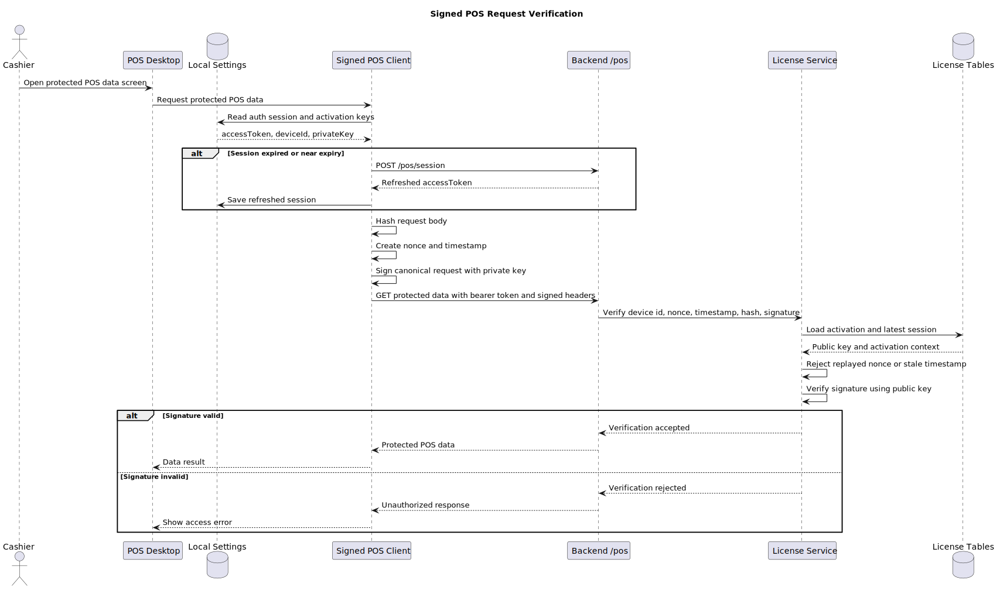
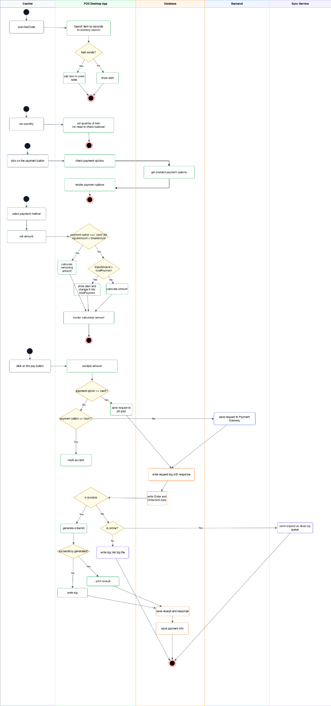
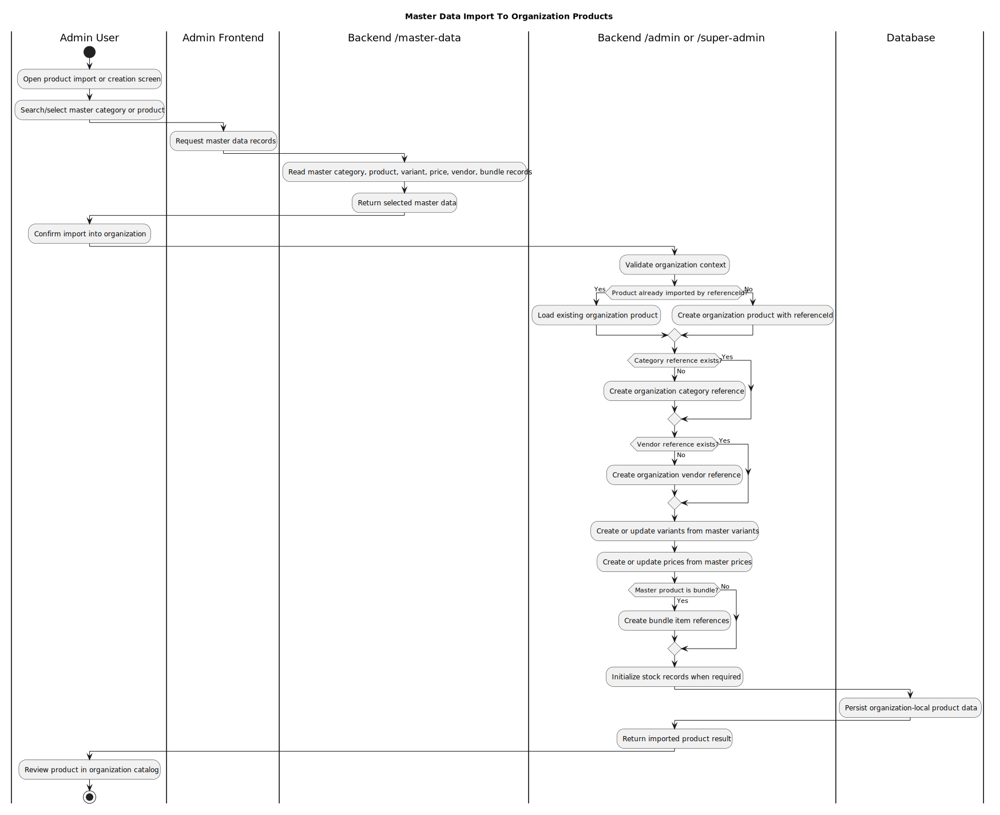

# Кассын систем
Architecture of the Pos system.

- Backend deployable service-г `/admin`, `/pos`, `/super-admin`, `/master-data` гэж тусад нь салгахгүй.
- Frontend app бүр өөрийн surface рүү хандана.
- Shared packages нь schema, database access, UI, permission middleware зэрэг cross-cutting logic-г хуваалцана. 
- `apps/backend` нь бүх backend surface-г нэг Elysia app дотор mount хийдэг.
- Admin, Super Admin, Internal Master Data, Desktop renderer нь тусдаа frontend app байна.
- PostgreSQL нь backend-ийн үндсэн persistent database.
- POS desktop нь PGlite local DB болон local settings ашиглана.

  

Өөрчлөгдсөн сүүлийн хувилбар болон мулть тенант хувилбар
[Class Diagrams](class-diagrams.md)

### Related Code

- `apps/backend/src/app.ts`
- `apps/backend/src/index.ts`
- `apps/frontend/admin`
- `apps/frontend/super-admin`
- `apps/frontend/internal-master-data`
- `apps/frontend/desktop`
- `packages/db-core`
- `packages/db-lite`
- `packages/db-schema`
  
## Authentication And Organization Access

- Хэрэглэгч нэг эрхээр олон байгууллага буюу `Org` рүү хандах боломжтой.
- Хэрэглэгч Admin систем рүү нэвтрэхэд тухайн хэрэглэгчид хамаарах бүх `Org` жагсаалт харагдана.
- Хэрэглэгч жагсаалтаас нэг `Org` сонгож тухайн байгууллагын context дотор ажиллана.
- Хэрэглэгч өөрийн шинэ `Org` үүсгэх боломжтой.
- Admin веб систем рүү хэрэглэгч нууц үгээр нэвтэрнэ.
- POS систем рүү хэрэглэгч PIN кодоор нэвтэрнэ.

### System 

- Admin нэвтрэлт нь хэрэглэгчийн үндсэн credential буюу username/password дээр суурилна.
- POS нэвтрэлт нь username/PIN дээр суурилна.
- Нэвтэрсний дараа хэрэглэгчийн `orgId`, `branchId`, role, permission нь тухайн session-ийн context болно.
- Хэрэглэгч олон `Org`-той бол систем эхлээд `Org` сонголт харуулна.
- POS desktop нь branch сонголт болон device/license activation хийсний дараа үндсэн POS screen рүү орно.

### Process Diagram

[Pos Login and License Activation](features/pos-login-and-license-activation.md)

### Related Code

- `apps/backend/pos/src/auth`
- `apps/backend/pos/src/org`
- `apps/backend/pos/src/license`
- `apps/frontend/desktop/src/main/services/auth`
- `apps/frontend/desktop/src/main/services/desktop-pos-service.ts`

## POS License And Signed Requests

- POS desktop төхөөрөмж бүр backend дээр license activation хийсэн байх ёстой.
- POS device нь `deviceId`, public key, private key ашиглан trusted device болж бүртгэгдэнэ.
- Backend зөвхөн active license бүхий байгууллагын POS activation-г зөвшөөрнө.
- Protected POS data request бүр signed header-тэй байна.
- Давтагдсан nonce, буруу signature, хугацаа хэтэрсэн timestamp бүхий request-г зөвшөөрөхгүй.
- POS desktop app дээрээ private, public key мөн unique deviceId үүсгэнэ
- Desktop private key-г зөвхөн local settings дотор хадгална.
- Backend public key болон activation/session мэдээллийг хадгална.
- Protected POS request хийхдээ desktop request body-г hash хийж, nonce/timestamp үүсгэнэ.
- Backend signature-г public key ашиглан шалгана.
- Signature valid бол request цааш API handler руу орно.

### Process Diagram

[Signed POS Request verification](features/signed-pos-request-verification.md)

### Related Code

- `apps/frontend/desktop/src/main/services/shared/pos-signed-client.ts`
- `apps/frontend/desktop/src/main/services/auth/pos-license-service.ts`
- `apps/backend/pos/src/signing/pos-signed-request.ts`
- `apps/backend/pos/src/license/license.service.ts`
- `packages/pos-signing/src/shared.ts`

## Role And Permission Access
- Backend асах бүрт шинэ нэмэгдсэн endpoint-г шалгаж permissions table рүү rquest method, path зэрэг мэдээллийг хадгална.
- Backend bearer token-г шалгаж user, org, role context гаргана.
- Route permission шаардаж байвал backend role permission жагсаалтыг database-аас уншина.
- POS desktop app-с ирэх хүсэлт нь 2 төрлийн шалгалт хийгдэнэ. Зарим хүсэлт нь bearer token шалгана /login, current user org and branch info, activation/ эсвэл signature request /fetch data/

### Process Diagram

[RBAC Permission Check](features/rbac-permission-check.md)

### Related Code

- `apps/backend/src/common/protected-app.ts`
- `apps/backend/src/common/permission-sync.ts`
- `packages/permission-middleware`
- `packages/db-schema/src/core/org.ts`

## Products

## POS Checkout And Payment

-Төлбөр амжилттай хийгдэж хэрэглэгчээс мөнгө гарсан хэрнээ өгөгдлийн сан рүү бичилт хийх эсвэл баримт үүсэх үед алдаа гарвал интернэтэд холбогдсон эсэхээс хамаарч error handle хийнэ. Хэрэв интернэтэд холболттой бол sync service рүү хүсэлт илгээнэ. Хэрэв offline ажиллаж байвал Лог файл рүү хадгална.
- Бараа уншуулах бүрт буюу сагс өөрчлөгдөх бүрт бөөний үнийн тохиргоо болон урамшуулал байагаа эсэхийг шалгана. Энэ шалгалт нь in memory хийгдэнэ. 

### Process Diagrams

### Related Code

- `apps/frontend/desktop/src/main/db/repositories/order-repository.ts`
- `apps/frontend/desktop/src/main/services/payment-process`
- `apps/backend/pos/src/payment`
- `packages/db-schema/src/lite/sales.ts`
- `packages/db-schema/src/lite/payment.ts`
- `packages/db-schema/src/lite/inventory.ts`

## 5. Master Data

- Master data нь category, product, variant, price, vendor, bundle-ийн эх үүсвэр болно.
- Organization-local product үүсэхдээ master record-ийн `referenceId`-г хадгална.
- Бүтээгдэхүүни үүсэх үед мастер дата-гаас хайж үзнэ./BarCode-р/

### Process Diagram

### Related Code

- `apps/backend/master-data/src`
- `apps/backend/super-admin/src/product`
- `apps/backend/admin/src/category`
- `apps/backend/src/domain/product/product-create.ts`
- `packages/db-schema/src/core/master.ts`

## 6. Inventory Stock Movement

- Stock movement бүр product, variant, branch context-тэй байна.
- Stock бууруулах operation хийхэд хангалттай үлдэгдэл байх ёстой.
- Sale checkout амжилттай бол stock буурна.
- Refund эсвэл receive operation stock нэмэгдүүлж болно.
- Stock movement бүр product log үүсгэнэ.
- Safety stock active бөгөөд үлдэгдэл minimum stock-оос бага бол low stock condition үүснэ.

### System

- Систем stock record байгаа эсэхийг шалгана.
- Байхгүй бол product/variant/branch-д зориулж stock record үүсгэнэ.
- Operation type-оос хамаарч quantity нэмэгдэнэ эсвэл буурна.
- Product log нь movement type, value, unit, product/variant reference хадгална.
- Safety stock тохиргоо active бол movement-ийн дараа үлдэгдлийг шалгана.

### Process Diagram

[Master Data import to Organization Products](features/master-data-import-to-organization-products.md)

### Related Code

- `packages/db-schema/src/core/inventory.ts`
- `packages/db-schema/src/lite/inventory.ts`
- `apps/frontend/desktop/src/main/db/repositories/order-repository.ts`
- `apps/backend/pos/src`
