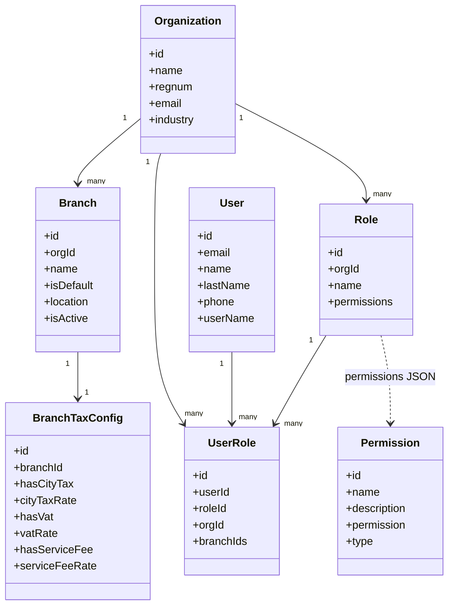
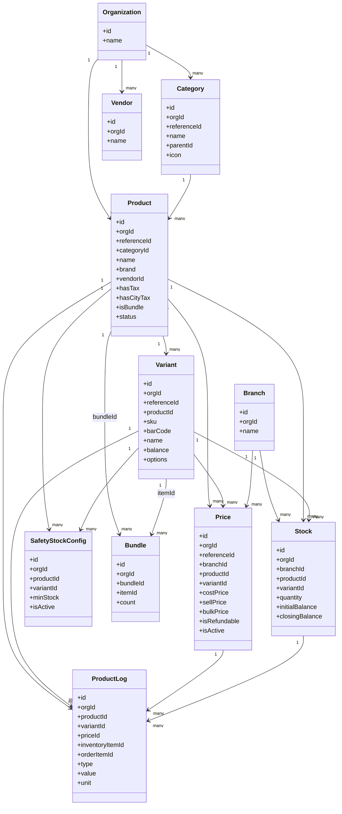
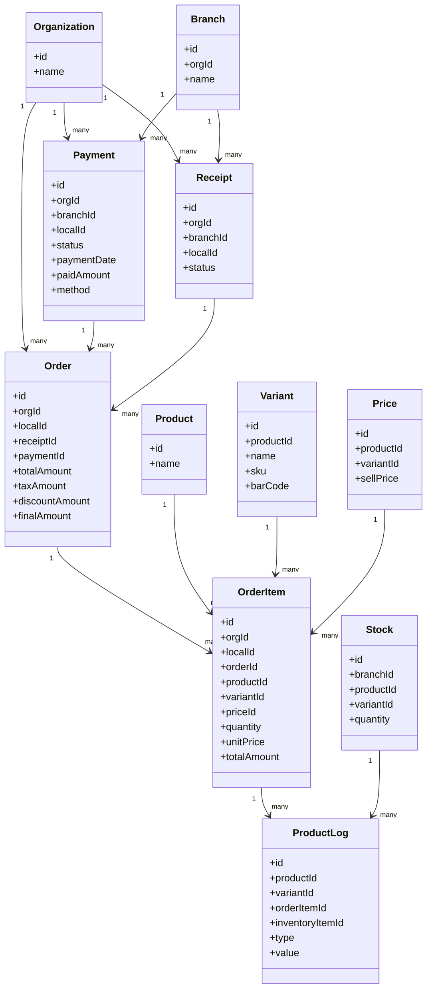
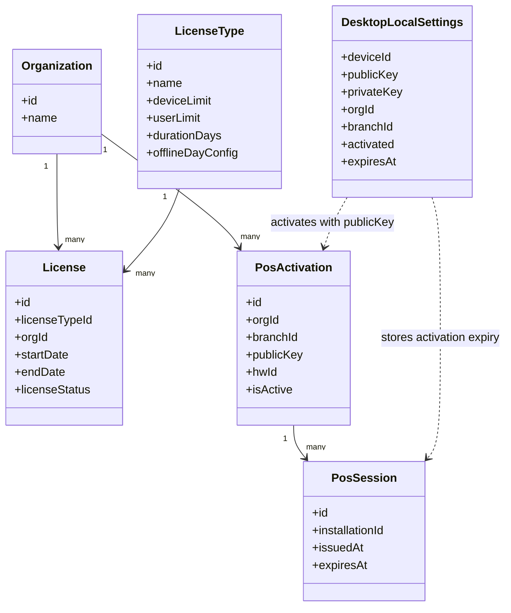

# Class Diagrams

Энэ документ нь Kass POS системийн үндсэн domain object-уудын class diagram-уудыг харуулна. Joplin дээр Mermaid plugin enabled үед эдгээр diagram шууд render хийгдэнэ.

## 1. Organization And Access

## 2. Product Catalog And Inventory

## 3. Checkout, Order, And Payment

## 4. POS License And Device

