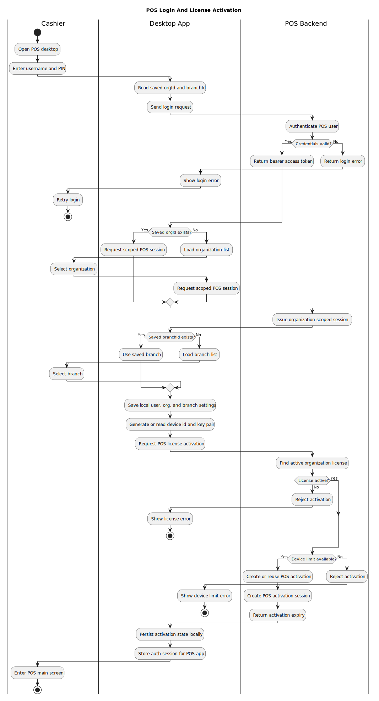
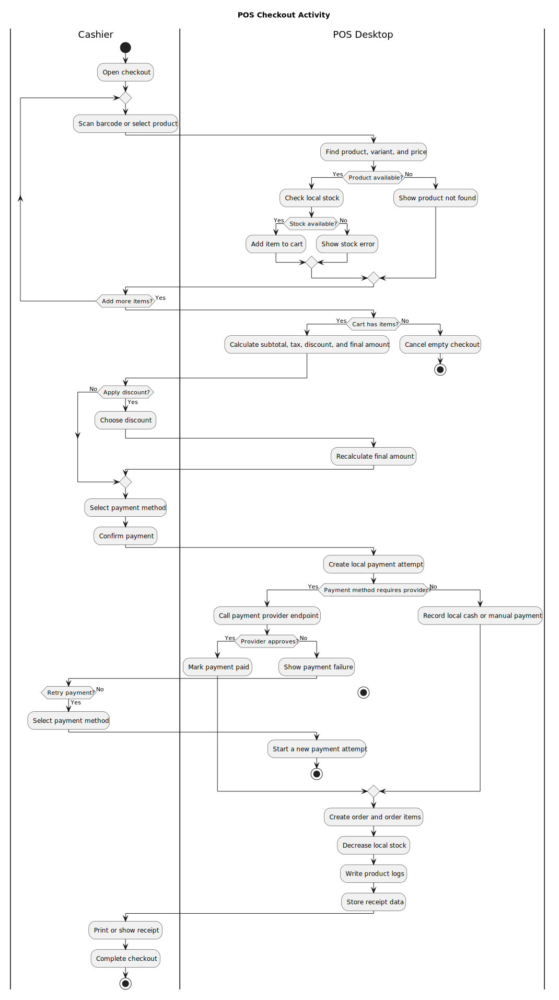
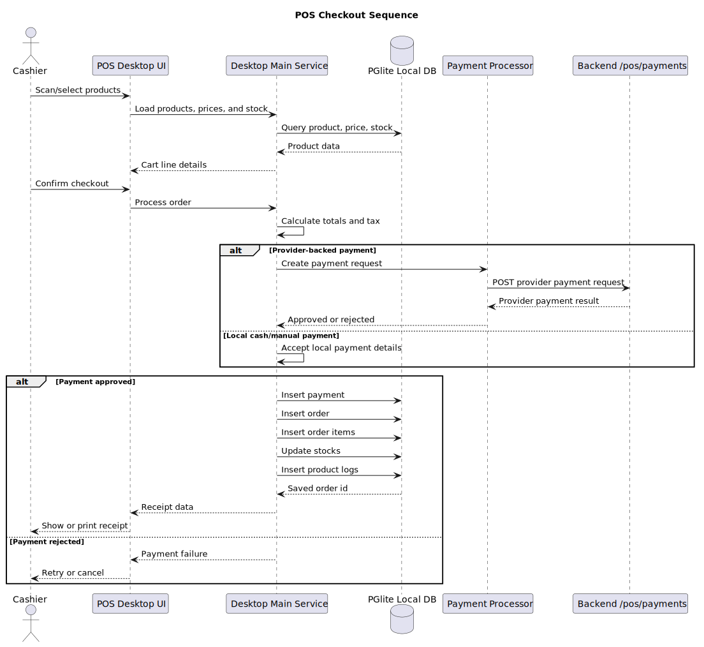
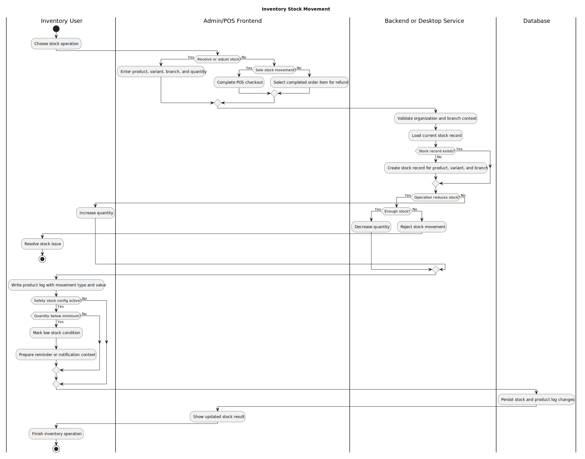
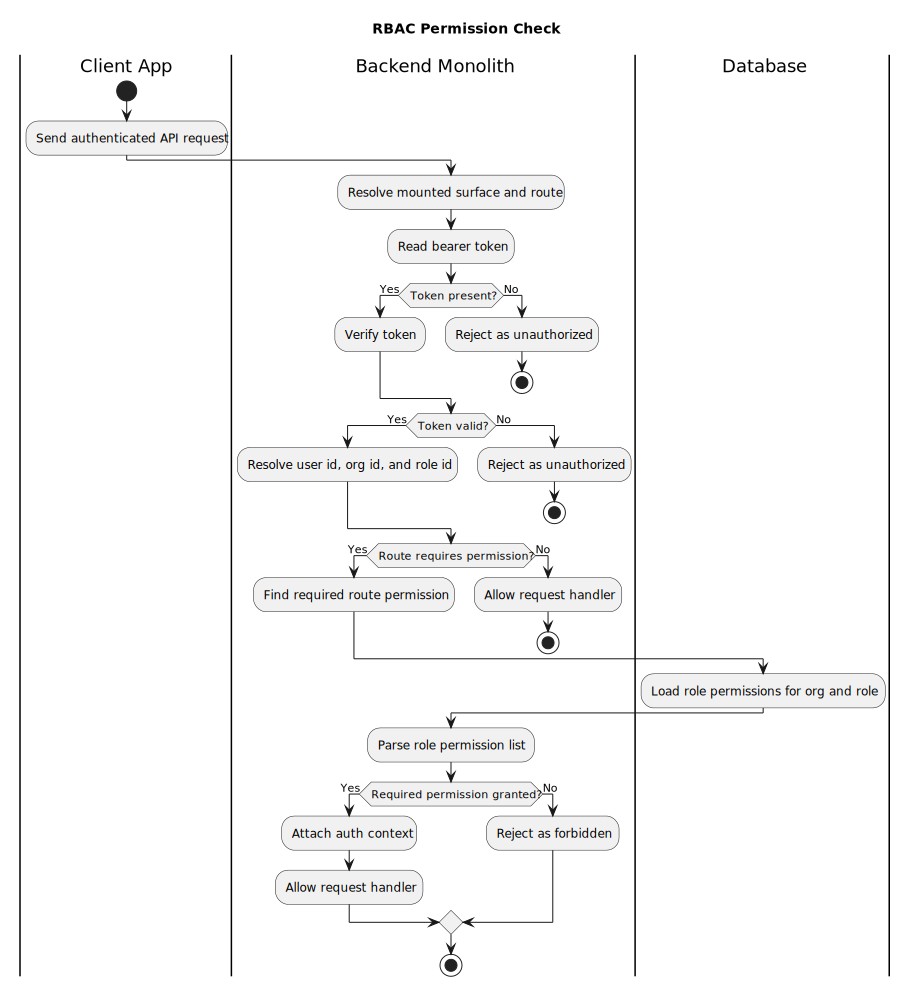
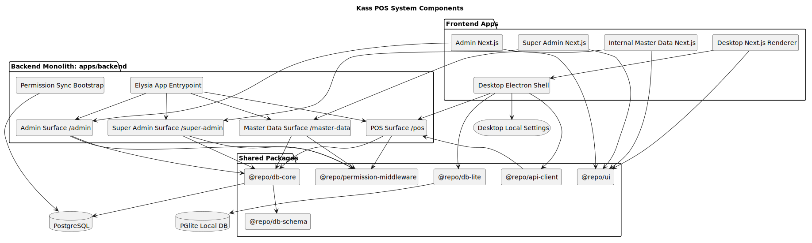

# PlantUML Diagrams

This directory contains editable PlantUML source diagrams and exported SVG diagrams for core Kass POS flows.

## POS Login And License Activation

Source: `pos-login-license-activity.puml`



## POS Checkout Activity

Source: `pos-checkout-activity.puml`



## POS Checkout Sequence

Source: `pos-checkout-sequence.puml`



## Signed POS Request Sequence

Source: `signed-pos-request-sequence.puml`


## Master Data Import

Source: `master-data-import-activity.puml`


## Inventory Stock Movement

Source: `inventory-stock-movement-activity.puml`



## RBAC Permission Check

Source: `rbac-permission-check-activity.puml`



## System Components

Source: `system-components.puml`



## Updating Diagrams

Render with a PlantUML extension or CLI, for example:

```sh
plantuml docs/diagrams/*.puml
```

Keep the `.puml` files as the source of truth and commit updated SVG exports for GitBook.
