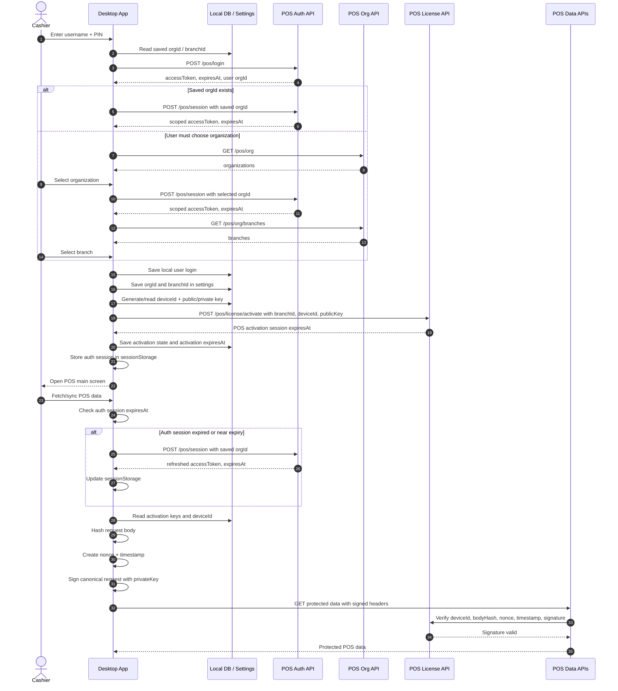

# Desktop Login Flow

## Signed Headers

- `x-pos-device-id`
- `x-pos-body-hash`
- `x-pos-nonce`
- `x-pos-signature`
- `x-pos-timestamp`

Org selection, branch selection, session creation, and activation are bearer-authenticated but not signed because they run before the desktop has an activated trusted device key.
