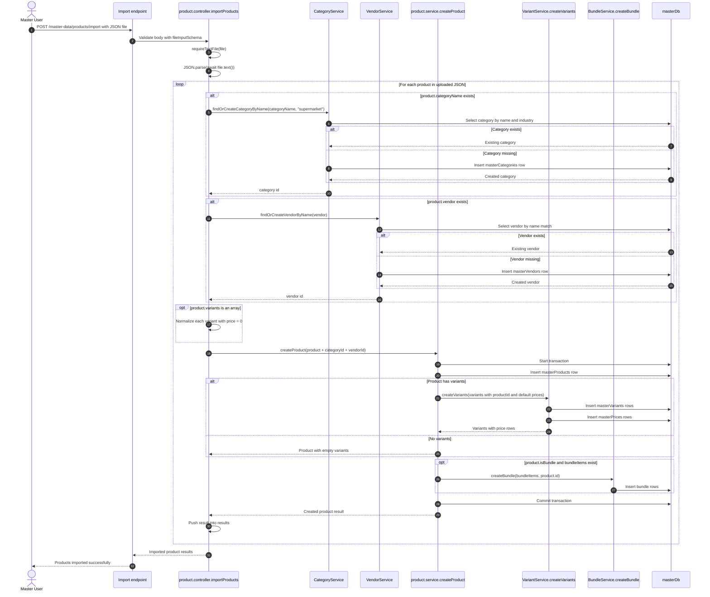

# Master Data Product Import Sequence

This sequence follows the current backend implementation in `apps/backend/master-data/src/product`.

## Code References

- `apps/backend/master-data/src/product/product.routes.ts`
- `apps/backend/master-data/src/product/product.controller.ts`
- `apps/backend/master-data/src/product/product.service.ts`
- `apps/backend/master-data/src/variant/variant.service.ts`
- `apps/backend/master-data/src/category/master.category.service.ts`
- `apps/backend/master-data/src/vendor/vendor.service.ts`
- `apps/backend/master-data/src/bundles/master-bundle.service.ts`
